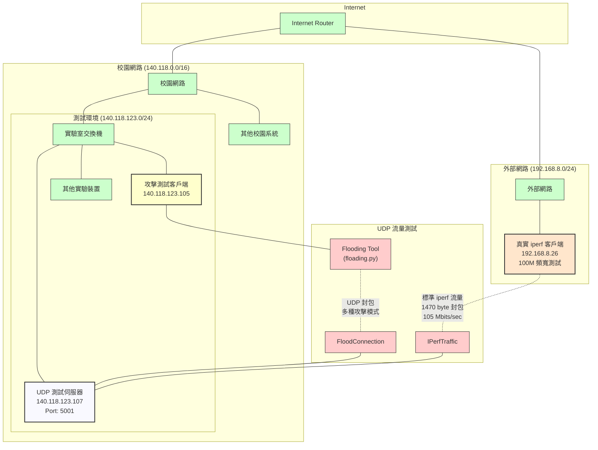

# 網路架構關係圖

下面的 Mermaid 圖表展示了 UDP 網路壅塞測試的網路架構：

## 測試環境說明

1. **網路架構**
   - 校園網路使用 140.118.0.0/16 網段
   - 測試環境位於 140.118.123.0/24 子網路
   - 測試機器：
     - UDP 測試伺服器 (140.118.123.107)
     - 攻擊測試客戶端 (140.118.123.105)
     - 真實 iperf 客戶端 (192.168.8.26)

2. **UDP 測試伺服器**
   - IP 地址: 140.118.123.107
   - 服務端口: 5001 (標準 iperf UDP 端口)
   - 運行 iperf 服務端: `iperf -s -u`
   - 負責接收並分析網路流量

3. **攻擊測試客戶端**
   - IP 地址: 140.118.123.105
   - 運行 floading.py 工具
   - 透過不同測試模式向伺服器發送 UDP 流量:
     - ultragentle: 最溫和的測試模式，小封包 (48 位元組)
     - gentle: 溫和測試模式，適中封包 (64 位元組)
     - balanced: 平衡測試模式
     - 其他更積極的測試模式

4. **真實 iperf 客戶端**
   - IP 地址: 192.168.8.26
   - 通過外部網路連接到測試伺服器
   - 運行標準 iperf 客戶端: `iperf -c 140.118.123.107 -u -b 100M -t 10`
   - 發送 1470 位元組大小的 UDP 封包
   - 實際測得頻寬: 105 Mbits/sec
   - 用於測量洪水攻擊前後的網路性能差異

5. **測試工具特性**
   - 多執行緒設計 (預設 2-3 執行緒，最多可達 20 執行緒)
   - 可調整封包大小 (48-128 位元組)
   - 支援不同攻擊模式 (波形式、脈衝式、隨機式等)
   - 內建流量控制和緩衝功能，避免網路崩潰

此架構適合進行各種網路壅塞測試，通過同時使用攻擊測試客戶端和真實 iperf 客戶端，可以在保持網路穩定的同時評估網路性能和承載能力的變化。
